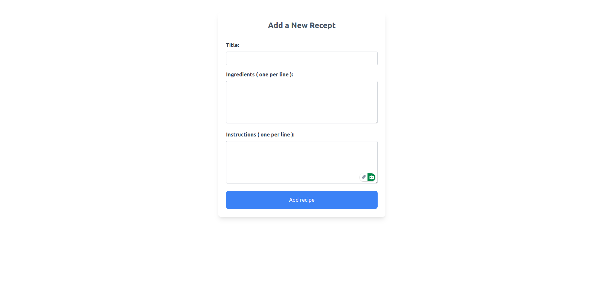

# 🍽️ React Recipe App  

A simple React app that displays a list of recipes and their details. Built with React, React Router, and Tailwind CSS.  





## 🚀 Features  
✅ View a list of recipes in a grid layout.  
✅ Click on a recipe to see its details (title, image, summary, ingredients, and instructions).  
✅ Responsive design using Tailwind CSS.  

## 🛠️ Installation  
1. Clone the repository  
2. Install dependencies  
3. Run the app 

1. **Clone the repository:**  
   ```sh
   git clone https://github.com/bir-dv/alx-fe-reactjs.git
   cd recipe-sharing-platform
